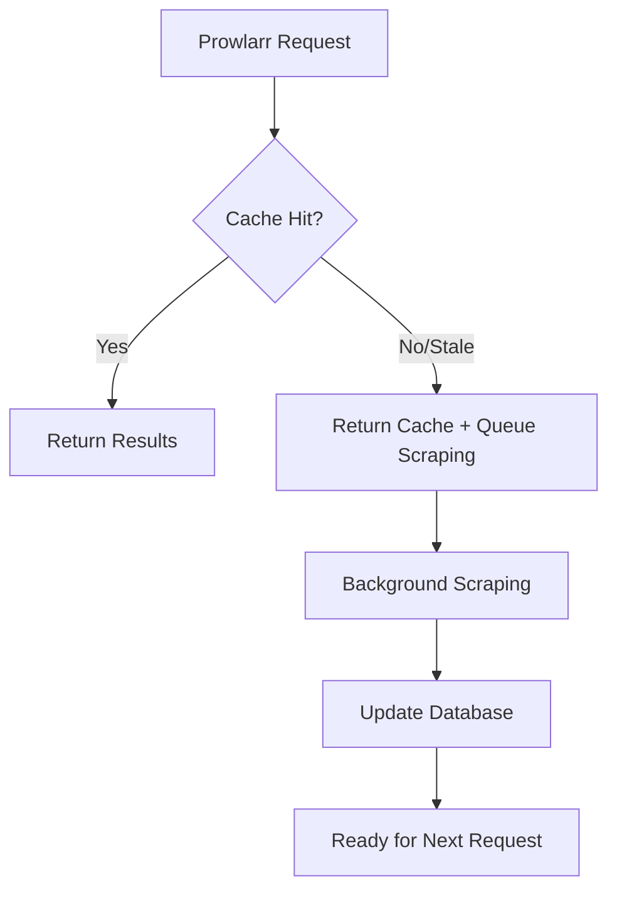

# Cinecalidad Enhanced Async Scraper

A powerful, async-enabled web scraper and Torznab indexer for Cinecalidad that works seamlessly with Prowlarr/Radarr. This tool provides lightning-fast responses through intelligent caching and background processing.

## ✨ Features

- **🚀 Async Architecture**: Instant responses with background scraping for optimal performance
- **📊 Torznab Compatible**: Full integration with Prowlarr, Radarr, and other *arr applications
- **💾 SQLite Caching**: Local database for fast searches and reduced server load
- **🔄 Auto-updating**: Periodic background scraping keeps content fresh
- **📈 Monitoring**: Built-in health checks and statistics endpoints
- **🎬 Smart Search**: Enhanced title matching with quality and language detection
- **🆔 IMDB Support**: Automatic IMDB ID resolution for better compatibility

## 🛠️ Requirements

- Python 3.8+
- Chrome/Chromium browser (for Playwright)

## 📦 Installation

### 1. Clone the Repository

```bash
git clone https://github.com/yourusername/cinecalidad-scraper.git
cd cinecalidad-scraper
```

### 2. Install Dependencies

```bash
pip install -r requirements.txt
```

**requirements.txt:**
```
flask>=2.0.0
playwright>=1.40.0
requests>=2.25.0
```

### 3. Install Playwright Browser

```bash
playwright install chromium
```

## 🚀 Quick Start

### Basic Usage (Server Mode)

Start the indexer server:

```bash
python cinecalidad_scraper.py
```

The server will start on `http://localhost:9697` with the following endpoints:
- `/api` - Main Torznab endpoint for Prowlarr
- `/stats` - Statistics and monitoring
- `/health` - Health check endpoint

### Test Mode

Test the scraper functionality:

```bash
# Test latest movies
python cinecalidad_scraper.py --test-scrape --limit 5

# Search for specific movie
python cinecalidad_scraper.py --test-scrape --query "Dune" --limit 3
```

## ⚙️ Configuration

### Command Line Arguments

#### Test Mode
- `--test-scrape`: Run scraper once and exit
- `--query "search term"`: Search for specific content
- `--limit N`: Limit number of results (default: 5)

#### Scraping Control
- `--max-pages N`: Pages to scrape during periodic updates (default: 2)
- `--disable-async`: Disable async scraping worker
- `--disable-periodic`: Disable periodic background scraping

#### Timeouts
- `--page-timeout N`: Page load timeout in seconds (default: 60)
- `--element-timeout N`: Element operation timeout (default: 15)
- `--navigation-timeout N`: Navigation timeout (default: 30)

#### Server
- `--log-level LEVEL`: Set logging level (DEBUG, INFO, WARNING, ERROR, CRITICAL)

### Environment Variables

You can modify these constants in the script:

```python
HOST = '0.0.0.0'                    # Server host
PORT = 9697                         # Server port
DB_FILE = 'cinecalidad_cache.sqlite' # Database file
SCRAPE_INTERVAL_SECONDS = 3600      # Periodic scraping interval
BASE_URL = 'https://www.cinecalidad.vg'
```

## 🔧 Prowlarr Integration

### Adding the Indexer

1. Open Prowlarr web interface
2. Go to **Settings** → **Indexers**
3. Click **Add Indexer** → **Generic Torznab**
4. Configure:
   - **Name**: Cinecalidad Enhanced
   - **URL**: `http://localhost:9697`
   - **API Path**: `/api`
   - **Categories**: 2000,2030,2040,2050 (Movies)
   - **API Key**: Leave empty

### Radarr Integration

The indexer supports:
- ✅ Interactive Search (Manual Search)
- ✅ Automatic Search (RSS)
- ✅ IMDB ID resolution
- ✅ Quality detection (720p, 1080p)
- ✅ Language detection (Latino, Dual, English)

## 📊 Monitoring

### Statistics Endpoint

Visit `http://localhost:9697/stats` for detailed statistics:

```json
{
  "total_movies": 1250,
  "movies_with_magnets": 1180,
  "scraped_last_24h": 45,
  "success_rate": "94.4%",
  "async_queue_size": 2,
  "active_scraping_tasks": 1,
  "worker_alive": true
}
```

### Health Check

Monitor health at `http://localhost:9697/health`:

```json
{
  "status": "healthy",
  "database": "ok",
  "async_worker": true,
  "timestamp": "2025-01-15T10:30:00Z"
}
```

### Queue Status

Check async queue at `http://localhost:9697/queue-status`:

```json
{
  "queue_size": 1,
  "active_tasks": ["Dune_1642248600"],
  "worker_alive": true
}
```

## 🐳 Docker Support

### Dockerfile

```dockerfile
FROM python:3.11-slim

# Install system dependencies
RUN apt-get update && apt-get install -y \
    wget \
    ca-certificates \
    && rm -rf /var/lib/apt/lists/*

WORKDIR /app

# Copy requirements and install Python dependencies
COPY requirements.txt .
RUN pip install --no-cache-dir -r requirements.txt

# Install Playwright and browser
RUN playwright install chromium
RUN playwright install-deps

# Copy application
COPY cinecalidad_scraper.py .

# Create volume for database
VOLUME ["/app/data"]

# Expose port
EXPOSE 9697

# Set environment variables
ENV DB_FILE=/app/data/cinecalidad_cache.sqlite

CMD ["python", "cinecalidad_scraper.py"]
```

### Docker Compose

```yaml
version: '3.8'
services:
  cinecalidad-scraper:
    build: .
    ports:
      - "9697:9697"
    volumes:
      - ./data:/app/data
    environment:
      - LOG_LEVEL=INFO
    restart: unless-stopped
```

## 🔍 How It Works

### Architecture

1. **Fast Response**: Queries are served instantly from SQLite cache
2. **Background Processing**: New searches trigger async scraping tasks
3. **Periodic Updates**: Background worker keeps database fresh
4. **Smart Caching**: Avoids duplicate work and respects rate limits

### Search Flow



## 🐛 Troubleshooting

### Common Issues

**Playwright Browser Not Found**
```bash
playwright install chromium
```

**Database Locked**
```bash
# Stop the server and remove lock
rm cinecalidad_cache.sqlite-wal
```

**No Results Found**
```bash
# Test scraping manually
python cinecalidad_scraper.py --test-scrape --query "popular movie"
```

**Timeout Errors**
```bash
# Increase timeouts for slow connections
python cinecalidad_scraper.py --page-timeout 120 --element-timeout 30
```

### Debug Mode

Enable detailed logging:

```bash
python cinecalidad_scraper.py --log-level DEBUG
```

## 📝 Advanced Usage

### Custom Search Patterns

The scraper uses multiple search patterns for better matching:
- Exact match: `query`
- With dots: `query.with.dots`
- Flexible: `query%with%wildcards`

### Quality Detection

Automatically detects and categorizes:
- **720p** → Movies/SD (2030)
- **1080p** → Movies/BluRay (2050)
- **Default** → Movies/HD (2040)

### Language Detection

Supports multiple audio tracks:
- **Latino** - Spanish dubbed
- **Dual** - Dual audio (Spanish + English)
- **English** - Original audio

## 🤝 Contributing

1. Fork the repository
2. Create a feature branch: `git checkout -b feature/amazing-feature`
3. Commit changes: `git commit -m 'Add amazing feature'`
4. Push to branch: `git push origin feature/amazing-feature`
5. Open a Pull Request

## ⚠️ Disclaimer

This tool is for educational purposes only. Please respect the terms of service of the websites you scrape and comply with your local laws regarding content downloading.

## 📄 License

This project is licensed under the MIT License - see the [LICENSE](LICENSE) file for details.

## 🙏 Acknowledgments

- [Playwright](https://playwright.dev/) for reliable web scraping
- [Flask](https://flask.palletsprojects.com/) for the web framework
- [Prowlarr](https://prowlarr.com/) for the excellent indexer management
- Cinecalidad for providing the content source

---

**⭐ Star this repo if it helped you!**